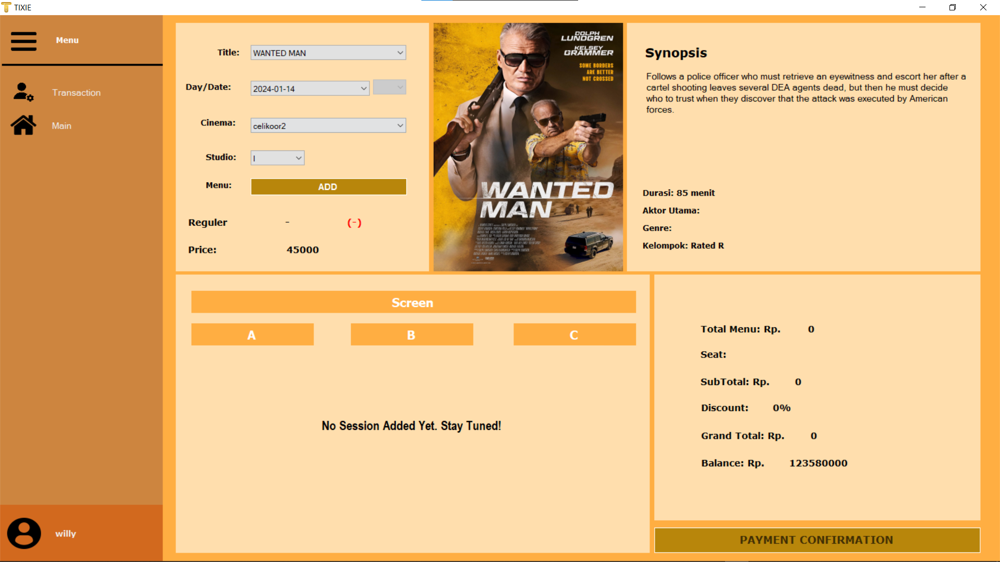
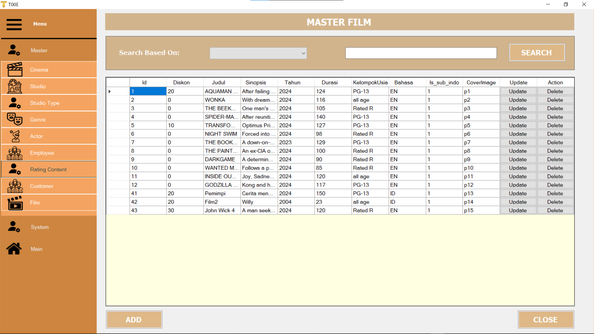
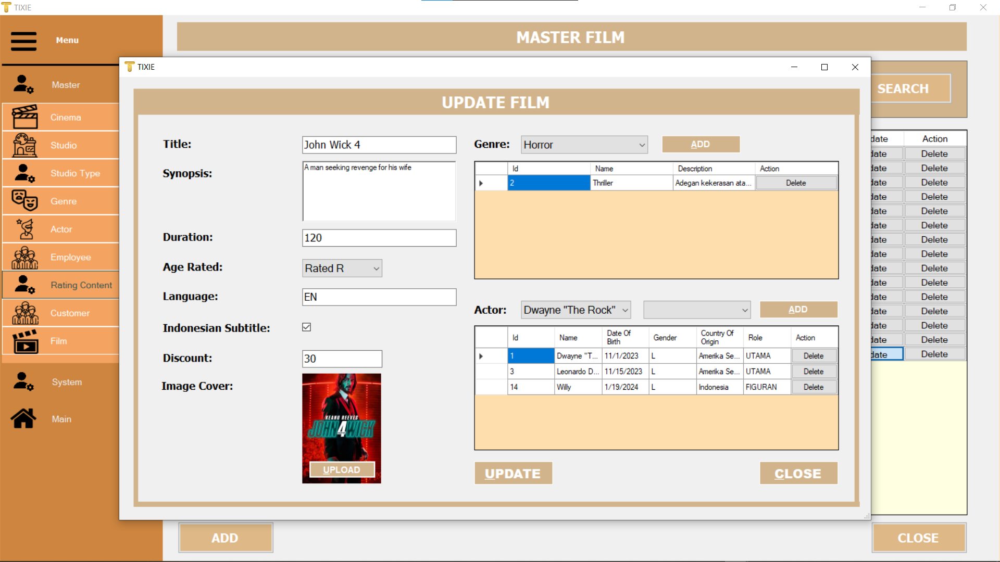
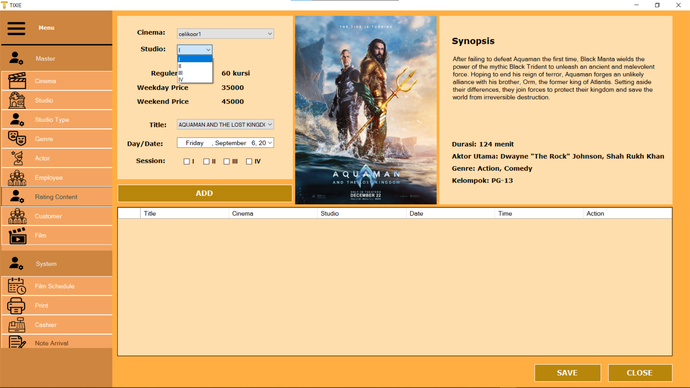
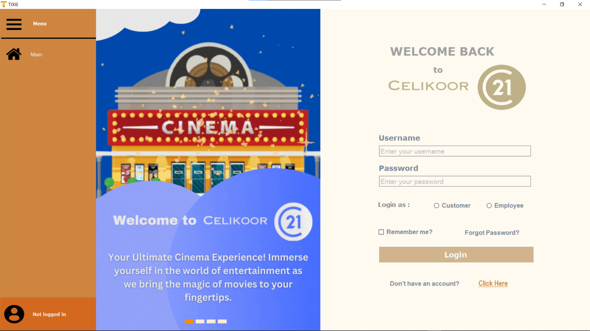

# Tixycket - Cinema Management Application

Tixycket is a cinema management application developed using **C# .NET** with **Microsoft Visual Studio**. It is designed to provide an efficient and modern interface for managing cinema operations, tailored for both employees and customers.

## Overview

This application is similar to cinema management systems used by major cinema chains such as XXI. Tixycket streamlines the process of managing schedules, movies, studios, and ticketing for cinemas.

### Key Features

- **User-Friendly Interface**: Tixycket comes with a modern and intuitive UI/UX, ensuring ease of use for both employees and customers.
  
- **Role-Based Access**: Different roles, such as Admins, Cashiers, Operators, and Servers, have specific access and privileges within the system to carry out their respective tasks efficiently.

- **Comprehensive Cinema Management**:
  - Add, update, and delete movies with detailed information such as title, genre, actors, and more.
  - Manage studios, movie schedules, and ticket sales.
  - View and manage invoices and transactions.
  - Maintain customer records and manage their bookings.

- **Detailed ERD (Entity Relationship Diagram)**:
  - The application is built on a well-structured database design, ensuring a clear relationship between entities like films, schedules, studios, customers, invoices, and tickets.
  - This allows for features such as adding new films, scheduling their showtimes, linking films to specific studios, managing genres and actors, and many more. Below is a simplified representation of the system's architecture.

### Database Design (ERD)


The above ERD shows the complex relationships between different entities within the application. Each entity (such as **Films**, **Studios**, **Sessions**, **Customers**, **Invoices**, etc.) is connected logically to allow smooth management of the cinema operations. These entities store crucial information, such as movie titles, show schedules, and customer bookings, to ensure the application's efficient performance.

### Screenshots
Here are some sample screenshots showcasing the application’s user interface and functionality:

- **Main Dashboard**
  

- **Movie Management Page**
  
  
  

- **Ticket Booking Interface**
  

- **Login Interface**
  
  
## Installation

To get started with Tixycket:

1. Clone the repository to your local machine.
2. Open the project in **Microsoft Visual Studio**.
3. Set up the database according to the ERD provided.
4. Build and run the project.

```bash
git clone https://github.com/WhoIsLiLY/Cinema_Celikoor_Application
```

### Usage
1. Login as an Admin, Cashier, Operator, or Customer using your assigned credentials.
2. Manage Movies: Add new films, assign them to studios, and set showtimes.
3. Sell Tickets: Cashiers can process ticket sales and generate invoices.
4. View Invoices: Review past transactions and customer purchases.
5. Monitor Cinema Activity: Operators can monitor studio status and movie sessions in real-time.

### Technologies Used
1. C# .NET Framework
2. Microsoft Visual Studio
3. MySQL (for database management)
4. Entity Framework (for ORM)
5. Windows Forms (for the GUI)

### Contributing
If you wish to contribute to the project, feel free to submit a pull request or report any issues. All contributions are welcome!

### License
This project is licensed under the MIT License. See the LICENSE file for details.
